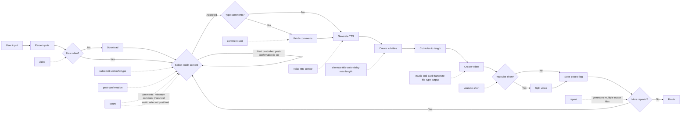

## How it works

If you want to see in depth how reddit-2-video works then continue reading otherwise, you can read the shortened down statement below:

> reddit-2-video is written 100% in dart and uses the command line to interact with other moving parts in order to create the working process. Currently reddit-2-video relies on [AWS Polly]() speech marks for subtitle timing as well as [ffmpeg]() to create the video with a custom set of arguments determined by the user input. Using Reddit JSON endpoints to fetch posts and comments, data is then processed and passed to [AWS Polly]() to create custom neural tts, while the ASS (Advanced SubStation Alpha) file format is used to create subtitles which can be animated and finetuned to change their appearance as need be.

### Why dart?

The first question you may ask - why use [dart]()? Well, the first reason was that I enjoyed writing apps in flutter and so was able to program in dart confidently. Apart from that, I did start this project off using [julia]() but quickly realised it was not suitable, then moving to a combination of dart and [python](), moving to pure dart allowed me to create code that could be compiled into executables using the `dart compile` command. This meant that the end user did not need to have the proprietary programming language installed on their machine. 
There is also a large community surrounding dart, with a lot of resources online. Using [pub.dev]() to find libraries to implement into the app ended up making time consuming parts of this project "less" time consuming.

### How is the video created?

The video is created using the [ffmpeg]() library by interacting with the CLI version of it. The background video is downloaded with [yt-dlp]() when needed and cut to the required length with `ffmpeg`. By passing the `.ass` subtitle file using the `subtitles` option, the subtitles get overlaid to the video while the generated TTS audio files are aligned and concatenated using `concat` in a `filter_complex`.

### How does TTS work?

The TTS in reddit-2-video is currently generated using [AWS Polly](). After the post and comment text has been fetched and cleaned up, the program sends each section of text to AWS Polly through the command line and saves the returned audio as `.mp3` files inside the temporary folder. This means each title, body or comment can be generated as its own piece of audio before being combined later on in the final ffmpeg command.

This is necessary because the narration audio is what drives the rest of the process. Once the text has been turned into speech, AWS Polly speech marks are generated alongside the audio so that timing data can be used for the subtitles. In other words, the TTS is not just there to make the video speak, it is also the thing that allows the subtitles to appear in the correct place at the correct time.

### Using the "reddit api"

Whilst reddit-2-video does not use the official Reddit API with an api key, it does use Reddit's JSON endpoints to get the data it needs. By adding `.json` to subreddit and post urls, the program can retrieve structured data for things such as the post title, body, id, upvotes, created time and comments without having to scrape the html from the page. This makes it much easier to extract the exact data needed and turn it into the models used by the app.

This is then used at different parts of the generation process. When the user passes a subreddit, reddit-2-video requests the subreddit JSON feed and filters the posts based on the command arguments. If the user passes a direct post link, the program resolves that post directly. For comment videos, the post JSON is also used to fetch the comments which are then cleaned up and turned into the text that gets passed into TTS and subtitle generation.

### Why use ASS and not SRT?

The main reason for using ASS instead of SRT is the styling effects. SRT works fine for basic subtitles, but it is far more limited when you want to control how the text actually looks on screen. ASS makes it possible to have much more control over the subtitle appearance such as colours, positioning and animated effects, which fits much better with the style of videos this project is trying to create.

Because of that, ASS ended up being the better choice for reddit-2-video. Since the subtitles are part of the presentation and not just plain captions, having the extra control over styling makes it easier to finetune how each line appears and behaves in the final video.
